# 🔐 SecureVault – Vault Password & Credential Management System

A secure full-stack web application for managing passwords and digital credentials. SecureVault provides secure credential storage, password generation, encryption, authentication, credential sharing, login monitoring, audit logging, security analytics, notifications, and cloud deployment.

---

## 📌 Table of Contents

* [Project Overview](#-project-overview)
* [Problem Statement](#-problem-statement)
* [Objectives](#-objectives)
* [Key Features](#-key-features)
* [Technology Stack](#-technology-stack)
* [System Architecture](#-system-architecture)
* [Development Milestones](#-development-milestones)
* [Backend Architecture](#-backend-architecture)
* [Frontend Architecture](#-frontend-architecture)
* [Database Architecture](#-database-architecture)
* [Application Flow](#-application-flow)
* [Authentication Flow](#-authentication-flow)
* [Password Vault Flow](#-password-vault-flow)
* [Password Generator Flow](#-password-generator-flow)
* [Credential Sharing Flow](#-credential-sharing-flow)
* [Login Monitoring Flow](#-login-monitoring-flow)
* [Audit Log Flow](#-audit-log-flow)
* [Notification and Email Flow](#-notification-and-email-flow)
* [Security Architecture](#-security-architecture)
* [Docker Architecture](#-docker-architecture)
* [AWS Deployment](#-aws-deployment)
* [GitHub Workflow](#-github-workflow)
* [Testing](#-testing)
* [Mobile Responsiveness](#-mobile-responsiveness)
* [Troubleshooting](#-troubleshooting)
* [Complete Development Lifecycle](#-complete-development-lifecycle)
* [Final Project Structure](#-final-project-structure)
* [Future Enhancements](#-future-enhancements)
* [Conclusion](#-conclusion)

---

# 📖 Project Overview

**SecureVault – Vault Password & Credential Management System** is a full-stack password management application developed using React, Spring Boot, PostgreSQL, Spring Security, JWT, BCrypt, AES encryption, Docker, and AWS EC2.

The application provides users with a secure platform to:

* Create and manage credentials
* Generate strong passwords
* Check password strength
* Encrypt sensitive credentials
* Share credentials securely
* Monitor login activity
* Maintain audit logs
* View security analytics
* Receive security notifications
* Receive email security alerts
* Monitor password expiration

The application was developed from the initial project planning stage through backend and frontend implementation, security integration, testing, GitHub version control, Docker containerization, and AWS EC2 deployment.

---

# ❗ Problem Statement

Managing multiple passwords and credentials manually creates several security risks.

Common problems include:

* Reusing the same password across multiple services
* Using weak passwords
* Storing passwords in insecure locations
* Forgetting credentials
* Sharing credentials through insecure communication channels
* Lack of login monitoring
* Lack of security notifications
* Lack of audit tracking
* Difficulty identifying suspicious account activity

SecureVault addresses these problems by providing a centralized and security-focused credential management system.

---

# 🎯 Objectives

The major objectives of SecureVault are:

1. Provide secure user authentication.
2. Store credentials securely.
3. Protect sensitive information using encryption.
4. Hash user account passwords using BCrypt.
5. Use JWT for authenticated API access.
6. Generate strong random passwords.
7. Evaluate password strength.
8. Allow secure credential sharing.
9. Track successful and failed login attempts.
10. Maintain audit logs.
11. Provide security analytics.
12. Generate in-app notifications.
13. Send security-related email notifications.
14. Monitor password expiration.
15. Provide a responsive user interface.
16. Containerize the application using Docker.
17. Deploy the complete system on AWS EC2.

---

# 🚀 Key Features

## 🔑 Authentication

* User registration
* User login
* JWT authentication
* BCrypt password hashing
* Protected REST APIs
* Authentication validation
* Login activity recording

## 🔐 Password Vault

* Add credentials
* View credentials
* Update credentials
* Delete credentials
* Manage stored credentials
* Secure sensitive credential storage

## 🎲 Password Generator

* Generate random passwords
* Custom password length
* Uppercase characters
* Lowercase characters
* Numbers
* Special characters
* Password strength evaluation

## 🤝 Credential Sharing

* Share credentials with other registered users
* Recipient-based access
* Shared credential management

## 📊 Security Monitoring

* Successful login tracking
* Failed login tracking
* Login activity history
* Audit logs
* Security analytics

## 🔔 Notifications

* In-app notifications
* Successful login notifications
* Security-related alerts
* Email notifications

## ⏳ Password Security

* Password age checking
* Password expiration monitoring
* Password strength checking

## ☁️ Deployment

* GitHub
* Docker
* Docker Compose
* AWS EC2
* PostgreSQL container
* Spring Boot container
* React/Nginx container

---

# 🛠 Technology Stack

| Category                | Technology                  |
| ----------------------- | --------------------------- |
| Frontend                | React                       |
| Frontend Build Tool     | Vite                        |
| Frontend HTTP Client    | Axios                       |
| Frontend Routing        | React Router                |
| Styling                 | CSS                         |
| Backend                 | Spring Boot 3.3.4           |
| Programming Language    | Java                        |
| Security                | Spring Security             |
| Authentication          | JWT                         |
| Password Hashing        | BCrypt                      |
| Encryption              | AES                         |
| ORM                     | Spring Data JPA / Hibernate |
| Database                | PostgreSQL 16               |
| Email                   | JavaMailSender              |
| Containerization        | Docker                      |
| Container Orchestration | Docker Compose              |
| Web Server              | Nginx                       |
| Cloud Platform          | AWS EC2                     |
| Version Control         | Git                         |
| Repository Hosting      | GitHub                      |

---

# 🏗 System Architecture

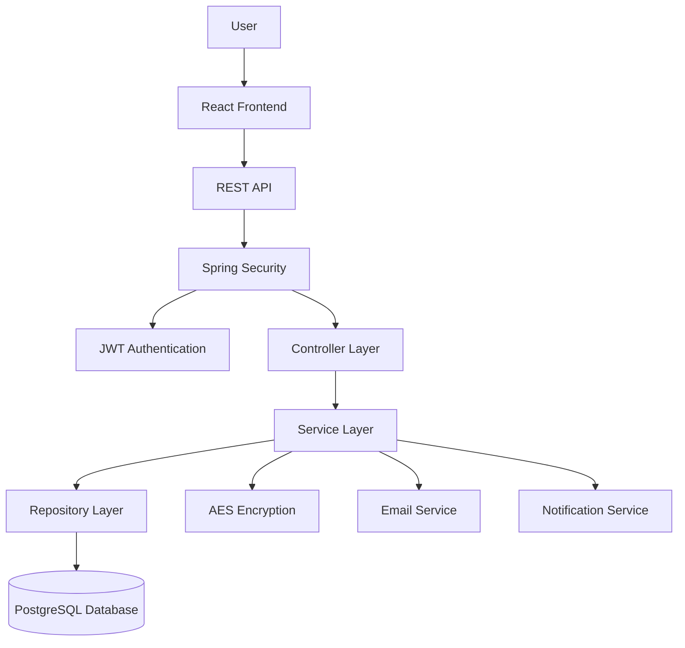
```mermaid
flowchart TD
    USER[User]

    FRONTEND[React Frontend]
    API[REST API]

    SECURITY[Spring Security]
    JWT[JWT Authentication]

    CONTROLLER[Controller Layer]
    SERVICE[Service Layer]
    REPOSITORY[Repository Layer]

    DATABASE[(PostgreSQL Database)]

    ENCRYPTION[AES Encryption]
    EMAIL[Email Service]
    NOTIFICATION[Notification Service]

    USER --> FRONTEND
    FRONTEND --> API
    API --> SECURITY
    SECURITY --> JWT
    SECURITY --> CONTROLLER

    CONTROLLER --> SERVICE
    SERVICE --> REPOSITORY
    REPOSITORY --> DATABASE

    SERVICE --> ENCRYPTION
    SERVICE --> EMAIL
    SERVICE --> NOTIFICATION
```

---

# 📚 Development Milestones

## Milestone 1 – Project Planning and Initial Setup

The first milestone focused on identifying the problem, defining requirements, selecting technologies, and designing the application.

### Activities

* Problem identification
* Requirement analysis
* Feature identification
* Technology selection
* System architecture design
* Backend project setup
* Frontend project setup
* PostgreSQL configuration
* Git repository setup

### Initial Architecture

```text
SecureVault
│
├── Frontend
│   └── React
│
├── Backend
│   └── Spring Boot
│
└── Database
    └── PostgreSQL
```

---

# Milestone 2 – Backend Development

The backend was developed using Spring Boot.

### Major backend modules

* Authentication
* User management
* Credential management
* Password generation
* Password strength checking
* Credential sharing
* Login monitoring
* Audit logging
* Notifications
* Security analytics
* Email notifications
* Password expiration

### Backend Request Flow

```text
Client
   ↓
Controller
   ↓
Service
   ↓
Repository
   ↓
PostgreSQL
```

---

# Milestone 3 – Frontend Development

The frontend was developed using React and Vite.

### Main application pages

* Login
* Registration
* Dashboard
* Password Vault
* Password Generator
* Shared Credentials
* Login Monitoring
* Audit Logs
* Notifications
* Security Analytics

### Frontend Request Flow

```text
User Interaction
       ↓
React Component
       ↓
Axios
       ↓
REST API
       ↓
Spring Boot Backend
       ↓
JSON Response
       ↓
React State
       ↓
Updated UI
```

---

# Milestone 4 – Security, Testing and UI Improvements

The fourth milestone focused on security implementation, testing, error handling, monitoring, and responsive design.

### Security Features

* JWT authentication
* BCrypt password hashing
* AES encryption
* Protected REST endpoints
* Authentication filters
* Environment variables
* Login monitoring
* Audit logging
* Security notifications
* Password expiration checking

### Testing

The following features were tested:

* Registration
* Login
* Invalid login
* Password vault
* Password generator
* Password strength
* Credential sharing
* Login monitoring
* Audit logs
* Notifications
* Security analytics
* Password expiration
* Mobile responsiveness

---

# 🏁 Final Integration

After completing the development milestones, all modules were integrated.

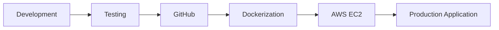
```mermaid
flowchart LR
    DEVELOPMENT[Development]
    TESTING[Testing]
    GITHUB[GitHub]
    DOCKER[Dockerization]
    AWS[AWS EC2]
    PRODUCTION[Production Application]

    DEVELOPMENT --> TESTING
    TESTING --> GITHUB
    GITHUB --> DOCKER
    DOCKER --> AWS
    AWS --> PRODUCTION
```

---

# ☕ Backend Architecture

The backend follows a layered architecture.

```text
Controller Layer
       ↓
Service Layer
       ↓
Repository Layer
       ↓
Database Layer
```

---

# 📁 Backend Project Structure

```text
backend/
│
├── src/
│   ├── main/
│   │   │
│   │   ├── java/
│   │   │   │
│   │   │   └── com/
│   │   │       │
│   │   │       └── securevault/
│   │   │           │
│   │   │           ├── controller/
│   │   │           │
│   │   │           ├── dto/
│   │   │           │
│   │   │           ├── entity/
│   │   │           │
│   │   │           ├── repository/
│   │   │           │
│   │   │           ├── service/
│   │   │           │
│   │   │           ├── security/
│   │   │           │
│   │   │           └── util/
│   │   │
│   │   └── resources/
│   │       │
│   │       └── application.properties
│   │
│   └── test/
│
├── pom.xml
└── Dockerfile
```

---

# 📦 Backend Package Responsibilities

## Controller

Responsible for:

* Receiving HTTP requests
* Validating request data
* Calling service methods
* Returning HTTP responses

Examples:

```text
AuthController
CredentialController
NotificationController
LoginMonitoringController
SecurityAnalyticsController
```

---

## DTO

DTOs are used for transferring data between the frontend and backend.

Examples:

```text
LoginRequest
RegisterRequest
CredentialRequest
ShareCredentialRequest
```

---

## Entity

Entities represent database tables.

Examples:

```text
User
Credential
SharedCredential
LoginActivity
AuditLog
Notification
```

---

## Repository

Repositories provide database access through Spring Data JPA.

```text
Service
   ↓
Repository
   ↓
JPA / Hibernate
   ↓
PostgreSQL
```

---

## Service

The service layer contains business logic.

Examples:

```text
AuthService
CredentialService
EmailService
NotificationService
PasswordExpirationService
SharingService
```

---

## Security

The security package handles:

* JWT authentication
* JWT validation
* Authentication filters
* Authorization
* Protected endpoints

---

## Utility

The utility layer provides reusable functions such as:

* AES encryption
* AES decryption
* Password generation
* Password strength calculation
* JWT-related utilities

---

# ⚛️ Frontend Architecture

The frontend follows a component and page-based React architecture.

```text
React Application
       │
       ├── Components
       │
       ├── Pages
       │
       ├── Services
       │
       └── Application Routing
```

---

# 📁 Frontend Project Structure

```text
frontend/
│
├── src/
│   │
│   ├── components/
│   │
│   ├── pages/
│   │   ├── Login.jsx
│   │   ├── Register.jsx
│   │   ├── Dashboard.jsx
│   │   ├── Vault.jsx
│   │   ├── PasswordGenerator.jsx
│   │   ├── SharedCredentials.jsx
│   │   ├── LoginMonitoring.jsx
│   │   ├── AuditLogs.jsx
│   │   ├── Notifications.jsx
│   │   └── SecurityAnalytics.jsx
│   │
│   ├── services/
│   │   └── api.js
│   │
│   ├── App.jsx
│   └── main.jsx
│
├── public/
│
├── package.json
├── vite.config.js
├── nginx.conf
└── Dockerfile
```

---

# 🗄 Database Architecture

PostgreSQL is used as the primary relational database.

The major entities are:

```text
User
 │
 ├── Credentials
 │
 ├── Login Activities
 │
 ├── Audit Logs
 │
 ├── Notifications
 │
 └── Shared Credentials
```

---

# 🗃 Database ER Diagram

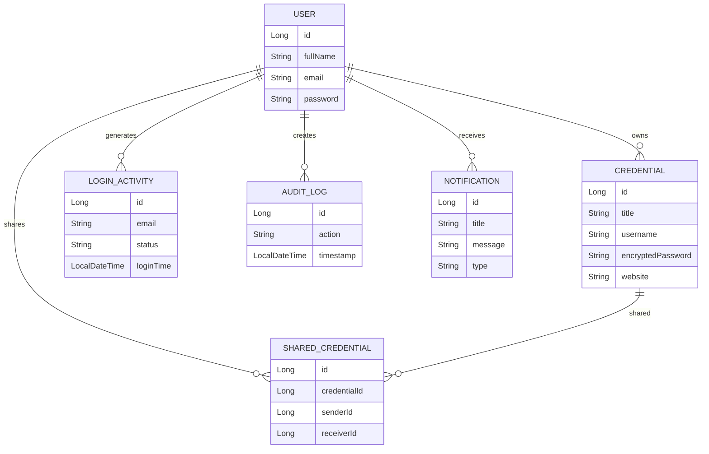
```mermaid
erDiagram

    USER ||--o{ CREDENTIAL : owns
    USER ||--o{ LOGIN_ACTIVITY : generates
    USER ||--o{ AUDIT_LOG : creates
    USER ||--o{ NOTIFICATION : receives
    USER ||--o{ SHARED_CREDENTIAL : shares

    CREDENTIAL ||--o{ SHARED_CREDENTIAL : shared

    USER {
        Long id
        String fullName
        String email
        String password
    }

    CREDENTIAL {
        Long id
        String title
        String username
        String encryptedPassword
        String website
    }

    SHARED_CREDENTIAL {
        Long id
        Long credentialId
        Long senderId
        Long receiverId
    }

    LOGIN_ACTIVITY {
        Long id
        String email
        String status
        LocalDateTime loginTime
    }

    AUDIT_LOG {
        Long id
        String action
        LocalDateTime timestamp
    }

    NOTIFICATION {
        Long id
        String title
        String message
        String type
    }
```

---

# 🔄 Application Flow

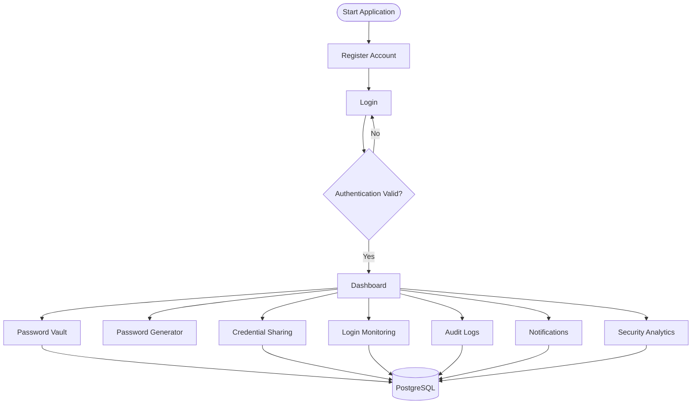
```mermaid
flowchart TD

    START([Start Application])

    REGISTER[Register Account]
    LOGIN[Login]
    AUTH{Authentication Valid?}

    DASHBOARD[Dashboard]

    VAULT[Password Vault]
    GENERATOR[Password Generator]
    SHARING[Credential Sharing]
    MONITOR[Login Monitoring]
    AUDIT[Audit Logs]
    NOTIFICATIONS[Notifications]
    ANALYTICS[Security Analytics]

    DATABASE[(PostgreSQL)]

    START --> REGISTER
    REGISTER --> LOGIN
    LOGIN --> AUTH

    AUTH -- No --> LOGIN
    AUTH -- Yes --> DASHBOARD

    DASHBOARD --> VAULT
    DASHBOARD --> GENERATOR
    DASHBOARD --> SHARING
    DASHBOARD --> MONITOR
    DASHBOARD --> AUDIT
    DASHBOARD --> NOTIFICATIONS
    DASHBOARD --> ANALYTICS

    VAULT --> DATABASE
    SHARING --> DATABASE
    MONITOR --> DATABASE
    AUDIT --> DATABASE
    NOTIFICATIONS --> DATABASE
    ANALYTICS --> DATABASE
```

---

# 👤 Registration Flow

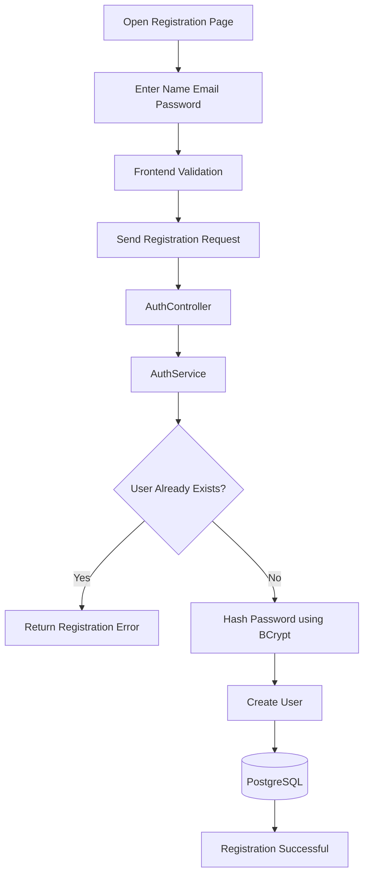
```mermaid
flowchart TD

    A[Open Registration Page]
    B[Enter Name Email Password]
    C[Frontend Validation]
    D[Send Registration Request]
    E[AuthController]
    F[AuthService]
    G{User Already Exists?}
    H[Return Registration Error]
    I[Hash Password using BCrypt]
    J[Create User]
    K[(PostgreSQL)]
    L[Registration Successful]

    A --> B
    B --> C
    C --> D
    D --> E
    E --> F
    F --> G

    G -- Yes --> H
    G -- No --> I
    I --> J
    J --> K
    K --> L
```

---

# 🔑 Authentication Flow

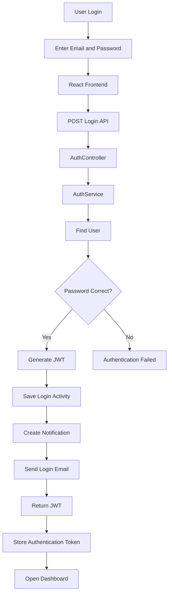
```mermaid
flowchart TD

    A[User Login]
    B[Enter Email and Password]
    C[React Frontend]
    D[POST Login API]
    E[AuthController]
    F[AuthService]
    G[Find User]
    H{Password Correct?}

    I[Generate JWT]
    J[Save Login Activity]
    K[Create Notification]
    L[Send Login Email]
    M[Return JWT]
    N[Store Authentication Token]
    O[Open Dashboard]

    X[Authentication Failed]

    A --> B
    B --> C
    C --> D
    D --> E
    E --> F
    F --> G
    G --> H

    H -- No --> X
    H -- Yes --> I
    I --> J
    J --> K
    K --> L
    L --> M
    M --> N
    N --> O
```

---

# 🛡 JWT Request Flow

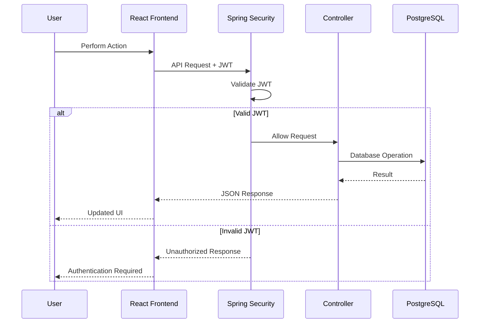
```mermaid
sequenceDiagram

    participant U as User
    participant F as React Frontend
    participant S as Spring Security
    participant C as Controller
    participant D as PostgreSQL

    U->>F: Perform Action
    F->>S: API Request + JWT
    S->>S: Validate JWT

    alt Valid JWT
        S->>C: Allow Request
        C->>D: Database Operation
        D-->>C: Result
        C-->>F: JSON Response
        F-->>U: Updated UI
    else Invalid JWT
        S-->>F: Unauthorized Response
        F-->>U: Authentication Required
    end
```

---

# 🔐 Password Vault Flow

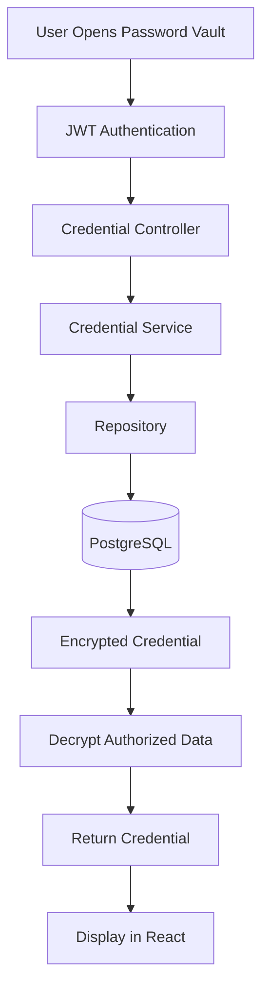
```mermaid
flowchart TD

    A[User Opens Password Vault]
    B[JWT Authentication]
    C[Credential Controller]
    D[Credential Service]
    E[Repository]
    F[(PostgreSQL)]
    G[Encrypted Credential]
    H[Decrypt Authorized Data]
    I[Return Credential]
    J[Display in React]

    A --> B
    B --> C
    C --> D
    D --> E
    E --> F
    F --> G
    G --> H
    H --> I
    I --> J
```

---

# 🔒 Credential Encryption Flow

Sensitive vault credentials are protected using encryption.

```text
User Credential
      ↓
AES Encryption
      ↓
Encrypted Credential
      ↓
PostgreSQL
```

When the authorized user retrieves the credential:

```text
PostgreSQL
      ↓
Encrypted Credential
      ↓
AES Decryption
      ↓
Authorized User
```

---

# 🎲 Password Generator Flow

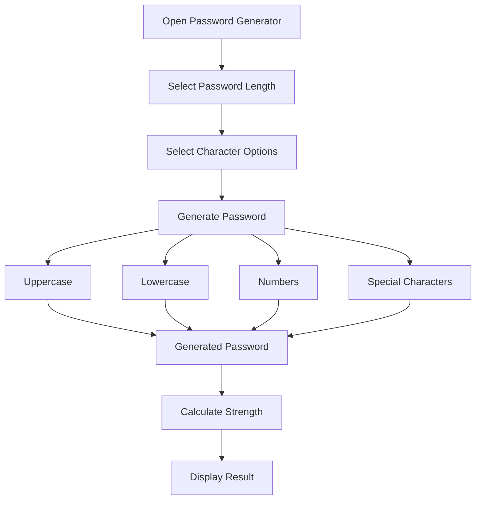
```mermaid
flowchart TD

    A[Open Password Generator]
    B[Select Password Length]
    C[Select Character Options]

    D[Generate Password]

    E[Uppercase]
    F[Lowercase]
    G[Numbers]
    H[Special Characters]

    I[Generated Password]
    J[Calculate Strength]
    K[Display Result]

    A --> B
    B --> C
    C --> D

    D --> E
    D --> F
    D --> G
    D --> H

    E --> I
    F --> I
    G --> I
    H --> I

    I --> J
    J --> K
```

---

# 📊 Password Strength Flow

```text
Password
   ↓
Analyze Length
   ↓
Check Uppercase
   ↓
Check Lowercase
   ↓
Check Numbers
   ↓
Check Special Characters
   ↓
Calculate Strength
   ↓
Weak / Medium / Strong
```

---

# 🤝 Credential Sharing Flow

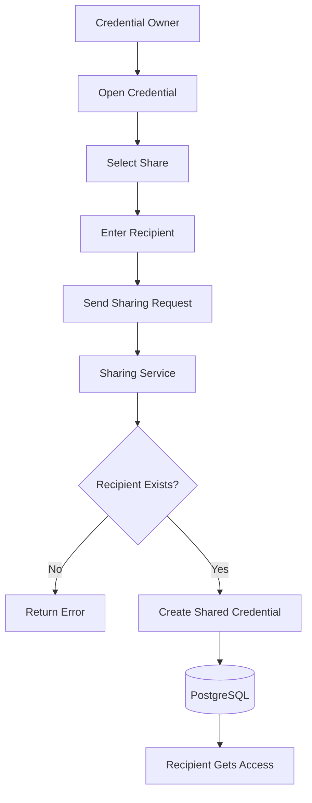
```mermaid
flowchart TD

    A[Credential Owner]
    B[Open Credential]
    C[Select Share]
    D[Enter Recipient]
    E[Send Sharing Request]
    F[Sharing Service]
    G{Recipient Exists?}

    H[Return Error]
    I[Create Shared Credential]
    J[(PostgreSQL)]
    K[Recipient Gets Access]

    A --> B
    B --> C
    C --> D
    D --> E
    E --> F
    F --> G

    G -- No --> H
    G -- Yes --> I
    I --> J
    J --> K
```

---

# 👁 Login Monitoring Flow

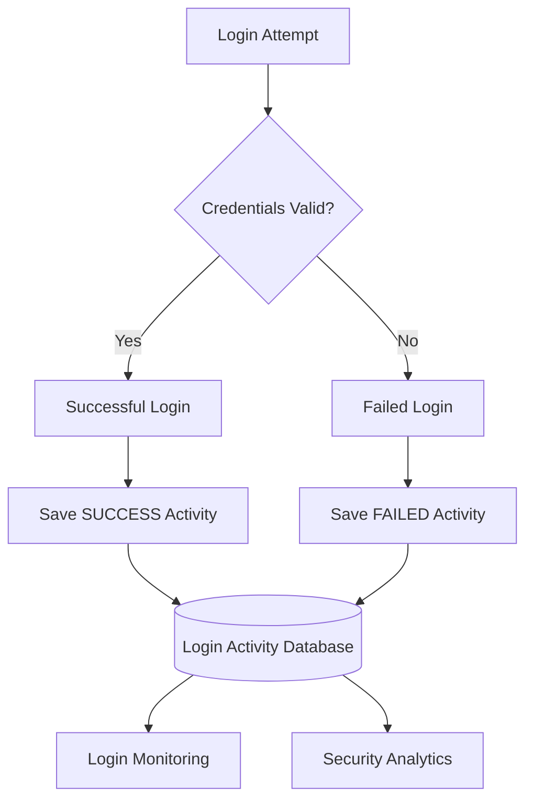
```mermaid
flowchart TD

    A[Login Attempt]
    B{Credentials Valid?}

    C[Successful Login]
    D[Failed Login]

    E[Save SUCCESS Activity]
    F[Save FAILED Activity]

    G[(Login Activity Database)]

    H[Login Monitoring]
    I[Security Analytics]

    A --> B

    B -- Yes --> C
    B -- No --> D

    C --> E
    D --> F

    E --> G
    F --> G

    G --> H
    G --> I
```

---

# 📝 Audit Log Flow

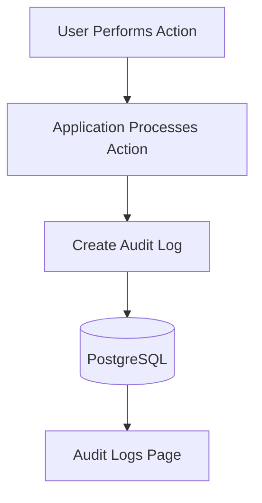
```mermaid
flowchart TD

    A[User Performs Action]
    B[Application Processes Action]
    C[Create Audit Log]
    D[(PostgreSQL)]
    E[Audit Logs Page]

    A --> B
    B --> C
    C --> D
    D --> E
```

Example actions include:

```text
LOGIN
LOGOUT
CREATE_CREDENTIAL
UPDATE_CREDENTIAL
DELETE_CREDENTIAL
SHARE_CREDENTIAL
SECURITY_ACTION
```

---

# 🔔 Notification and Email Flow

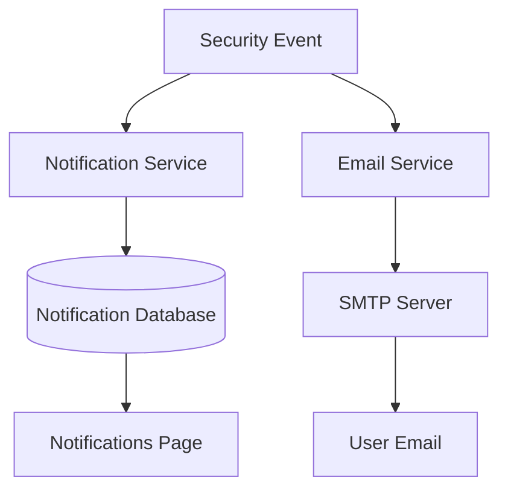
```mermaid
flowchart TD

    A[Security Event]

    B[Notification Service]
    C[(Notification Database)]
    D[Email Service]
    E[SMTP Server]
    F[User Email]

    G[Notifications Page]

    A --> B
    B --> C
    C --> G

    A --> D
    D --> E
    E --> F
```

---

# 📧 Successful Login Security Flow

When a user successfully logs in:

```text
Successful Login
      ↓
Save Login Activity
      ↓
Create In-App Notification
      ↓
Send Security Email
      ↓
Password Expiration Check
      ↓
Dashboard Access
```

---

# ⏳ Password Expiration Flow

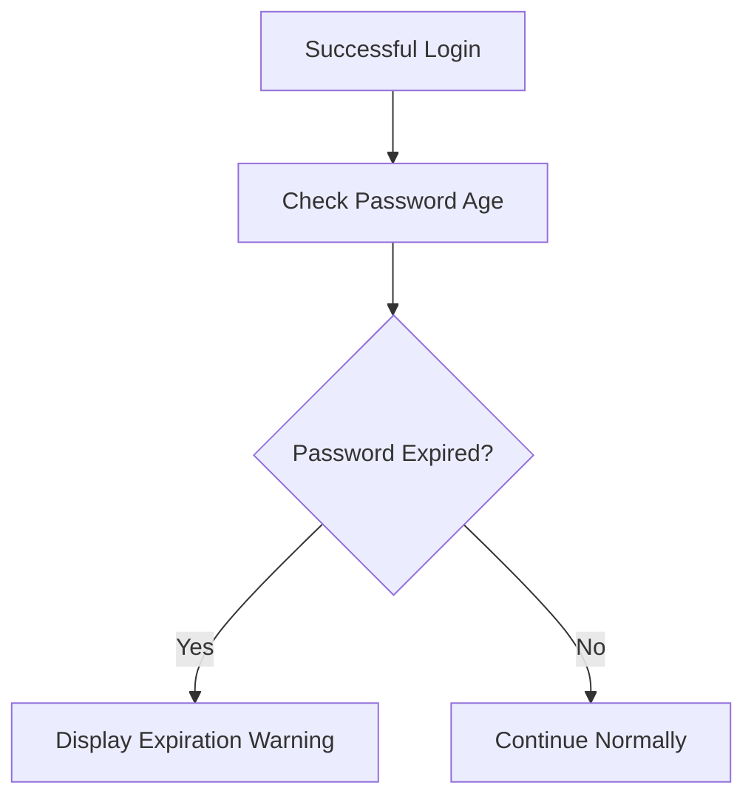
```mermaid
flowchart TD

    A[Successful Login]
    B[Check Password Age]
    C{Password Expired?}

    D[Display Expiration Warning]
    E[Continue Normally]

    A --> B
    B --> C

    C -- Yes --> D
    C -- No --> E
```

---

# 🛡 Security Architecture

SecureVault uses multiple security mechanisms.

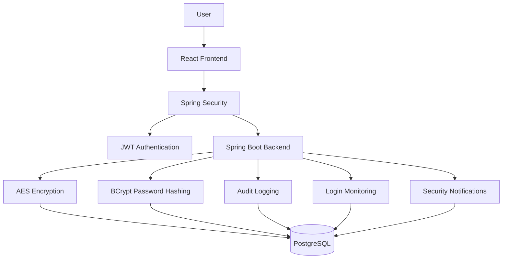
```mermaid
flowchart TD

    USER[User]

    FRONTEND[React Frontend]

    SECURITY[Spring Security]
    JWT[JWT Authentication]
    BCRYPT[BCrypt Password Hashing]
    AES[AES Encryption]

    BACKEND[Spring Boot Backend]
    DATABASE[(PostgreSQL)]

    AUDIT[Audit Logging]
    MONITOR[Login Monitoring]
    NOTIFICATION[Security Notifications]

    USER --> FRONTEND
    FRONTEND --> SECURITY

    SECURITY --> JWT
    SECURITY --> BACKEND

    BACKEND --> BCRYPT
    BACKEND --> AES

    AES --> DATABASE
    BCRYPT --> DATABASE

    BACKEND --> AUDIT
    BACKEND --> MONITOR
    BACKEND --> NOTIFICATION

    AUDIT --> DATABASE
    MONITOR --> DATABASE
    NOTIFICATION --> DATABASE
```

---

# 🔑 BCrypt Password Security

User account passwords are hashed before being stored.

```text
Plain Password
      ↓
    BCrypt
      ↓
Password Hash
      ↓
PostgreSQL
```

The original account password is not stored directly.

---

# 🔐 AES Credential Security

Vault credentials are encrypted before storage.

```text
Credential
     ↓
AES Encryption
     ↓
Encrypted Data
     ↓
PostgreSQL
```

When required by an authorized user:

```text
Encrypted Data
     ↓
AES Decryption
     ↓
Credential
     ↓
Authorized User
```

---

# 🌐 Frontend–Backend Communication

The frontend communicates with the Spring Boot backend through REST APIs.

```text
React Frontend
      ↓
Axios
      ↓
REST API
      ↓
Spring Boot
      ↓
Spring Security
      ↓
Controller
      ↓
Service
      ↓
Repository
      ↓
PostgreSQL
```

The frontend API configuration uses:

```javascript
baseURL: import.meta.env.VITE_API_URL || "http://localhost:8080/api"
```

---

# 🐳 Docker Architecture

The complete application is containerized.

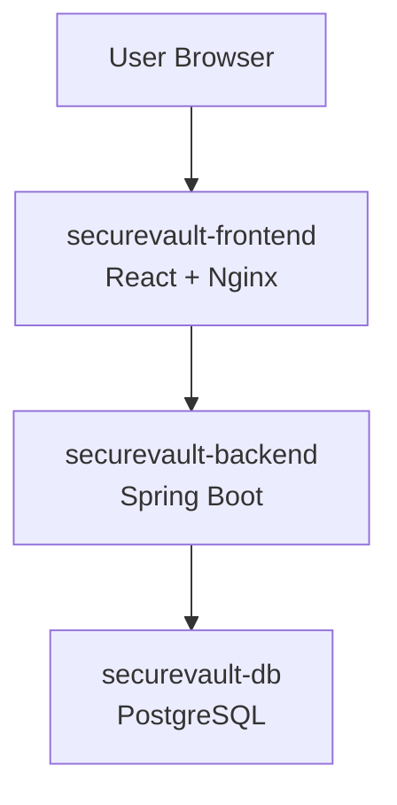
```mermaid
flowchart TD

    USER[User Browser]

    FRONTEND[securevault-frontend<br/>React + Nginx]
    BACKEND[securevault-backend<br/>Spring Boot]
    DATABASE[securevault-db<br/>PostgreSQL]

    USER --> FRONTEND
    FRONTEND --> BACKEND
    BACKEND --> DATABASE
```

---

# 🐳 Docker Container Structure

## Frontend

```text
React Source Code
       ↓
Vite Build
       ↓
Static Production Files
       ↓
Nginx
       ↓
Port 80
```

## Backend

```text
Spring Boot Application
       ↓
Java Runtime
       ↓
Port 8080
```

## Database

```text
PostgreSQL 16
       ↓
Database: securevault_db
       ↓
Port 5432
```

---

# 🐳 Docker Compose Architecture

The application uses three main services:

```text
docker-compose.yml
│
├── db
│   └── PostgreSQL
│
├── backend
│   └── Spring Boot
│
└── frontend
    └── React + Nginx
```

Container communication:

```text
Frontend
    ↓
Backend:8080
    ↓
Database:5432
```

The backend connects to PostgreSQL using the Docker service name:

```text
jdbc:postgresql://db:5432/securevault_db
```

---

# ☁️ AWS Deployment Architecture

SecureVault was deployed on an AWS EC2 instance.

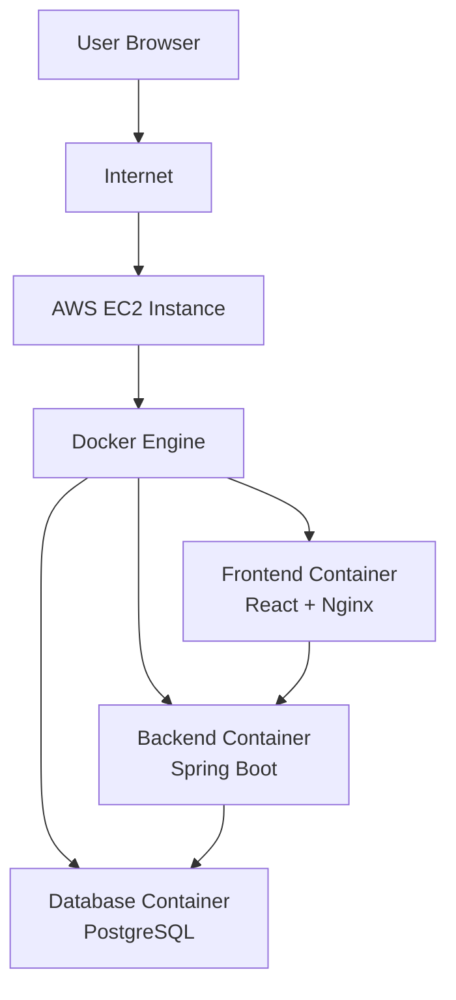
```mermaid
flowchart TD

    USER[User Browser]
    INTERNET[Internet]

    EC2[AWS EC2 Instance]
    DOCKER[Docker Engine]

    FRONTEND[Frontend Container<br/>React + Nginx]
    BACKEND[Backend Container<br/>Spring Boot]
    DATABASE[Database Container<br/>PostgreSQL]

    USER --> INTERNET
    INTERNET --> EC2
    EC2 --> DOCKER

    DOCKER --> FRONTEND
    DOCKER --> BACKEND
    DOCKER --> DATABASE

    FRONTEND --> BACKEND
    BACKEND --> DATABASE
```

---

# ☁️ AWS Infrastructure

The deployment environment consists of:

```text
AWS
│
└── EC2 Instance
    │
    ├── Amazon Linux 2023
    │
    ├── Docker
    │
    ├── Docker Compose
    │
    ├── securevault-frontend
    │
    ├── securevault-backend
    │
    └── securevault-db
```

---

# 🔌 AWS Security Group

The EC2 security group was configured for application access.

| Port | Purpose     |
| ---: | ----------- |
|   22 | SSH         |
|   80 | HTTP        |
| 5173 | Frontend    |
| 8080 | Backend API |
| 5432 | PostgreSQL  |

PostgreSQL should preferably remain inaccessible from the public internet when only the backend needs database access.

---

# 🔐 Environment Configuration

Sensitive configuration values are stored using environment variables.

Example:

```env
DB_PASSWORD=<database-password>

JWT_SECRET=<strong-jwt-secret>

MAIL_USERNAME=<email-address>

MAIL_PASSWORD=<mail-app-password>
```

Real secrets should **never** be committed to GitHub.

---

# 🚫 Secret Protection

The `.env` file should be excluded from Git.

Example `.gitignore`:

```gitignore
.env
*.env
node_modules/
target/
dist/
```

Never commit:

```text
Database passwords
JWT secrets
Email passwords
API keys
Private keys
```

---

# 🔄 Environment Variable Flow

```text
.env
 │
 ├── DB_PASSWORD
 ├── JWT_SECRET
 ├── MAIL_USERNAME
 └── MAIL_PASSWORD
        │
        ▼
Docker Compose
        │
        ▼
Backend Container
        │
        ▼
Spring Boot
```

---

# 🐳 Docker Deployment Process

## 1. Connect to EC2

```bash
ssh -i <key-file>.pem ec2-user@<EC2_PUBLIC_IP>
```

## 2. Navigate to Project

```bash
cd /home/ec2-user/Vault-password-Credential-Management-System
```

## 3. Check Docker

```bash
docker --version
```

```bash
docker compose version
```

## 4. Build Backend Image

```bash
docker build -t securevault-backend:latest ./backend
```

## 5. Build Frontend Image

```bash
docker build \
  --build-arg VITE_API_URL=http://<EC2_PUBLIC_IP>:8080/api \
  -t securevault-frontend:latest ./frontend
```

## 6. Start Application

```bash
docker compose up -d
```

## 7. Check Running Containers

```bash
docker ps
```

Expected containers:

```text
securevault-db
securevault-backend
securevault-frontend
```

---

# 🔄 Deployment Flowchart

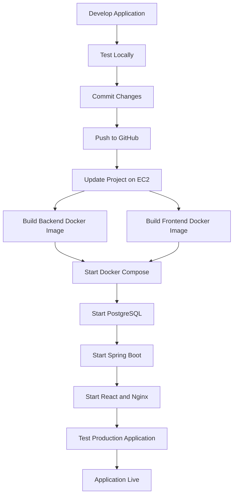
```mermaid
flowchart TD

    A[Develop Application]
    B[Test Locally]
    C[Commit Changes]
    D[Push to GitHub]
    E[Update Project on EC2]

    F[Build Backend Docker Image]
    G[Build Frontend Docker Image]

    H[Start Docker Compose]

    I[Start PostgreSQL]
    J[Start Spring Boot]
    K[Start React and Nginx]

    L[Test Production Application]
    M[Application Live]

    A --> B
    B --> C
    C --> D
    D --> E

    E --> F
    E --> G

    F --> H
    G --> H

    H --> I
    I --> J
    J --> K

    K --> L
    L --> M
```

---

# 🐙 GitHub Workflow

Git and GitHub are used for source-code version control.

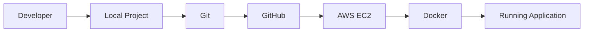
```mermaid
flowchart LR

    DEVELOPER[Developer]
    LOCAL[Local Project]
    GIT[Git]
    GITHUB[GitHub]
    EC2[AWS EC2]
    DOCKER[Docker]
    APP[Running Application]

    DEVELOPER --> LOCAL
    LOCAL --> GIT
    GIT --> GITHUB
    GITHUB --> EC2
    EC2 --> DOCKER
    DOCKER --> APP
```

---

# 🔧 Git Commands

Check project status:

```bash
git status
```

Add changes:

```bash
git add .
```

Commit changes:

```bash
git commit -m "Update project"
```

Push changes:

```bash
git push origin main
```

Pull latest changes:

```bash
git pull origin main
```

---

# 🔄 GitHub to AWS Deployment Flow

```text
Developer
    ↓
Local Development
    ↓
Git
    ↓
GitHub
    ↓
AWS EC2
    ↓
Docker Build
    ↓
Docker Compose
    ↓
Production Application
```

---

# 🧪 Testing

Testing was performed after implementing the major modules.

## Functional Testing

| Feature       | Test Case                     |
| ------------- | ----------------------------- |
| Registration  | Register a new user           |
| Login         | Login using valid credentials |
| Login         | Reject invalid credentials    |
| Vault         | Add credential                |
| Vault         | View credential               |
| Vault         | Update credential             |
| Vault         | Delete credential             |
| Generator     | Generate password             |
| Generator     | Check password strength       |
| Sharing       | Share credential              |
| Monitoring    | Record login activity         |
| Audit         | Record application actions    |
| Notifications | Generate notification         |
| Analytics     | Display security statistics   |
| Expiration    | Check password expiration     |
| Responsive UI | Test mobile layout            |

---

# 🔐 Security Testing

## Invalid Login

```text
Invalid Credentials
       ↓
Authentication Failure
       ↓
Login Rejected
       ↓
Failed Login Recorded
```

## Missing JWT

```text
Request without JWT
       ↓
Protected API
       ↓
Spring Security
       ↓
Unauthorized Response
```

## Encrypted Credential

```text
Credential
       ↓
AES Encryption
       ↓
Encrypted Value
       ↓
Database
```

---

# 📱 Mobile Responsiveness

The frontend was optimized for desktop and mobile screens.

Responsive areas include:

* Dashboard
* Password Vault
* Login Monitoring
* Audit Logs
* Security Analytics
* Notifications
* Tables
* Navigation

For wide tables, horizontal scrolling is used so information is not unnecessarily cropped.

Example:

```css
.analytics-table-wrapper {
    width: 100%;
    max-width: 100%;
    overflow-x: auto;
    overflow-y: hidden;
    -webkit-overflow-scrolling: touch;
}

.analytics-table {
    width: max-content;
    min-width: 600px;
    max-width: none;
    table-layout: auto;
}
```

---

# ⚠️ Error Handling

The application handles common errors such as:

* Invalid login credentials
* Unauthorized API requests
* Missing input
* Duplicate registration
* Invalid credential operations
* Database errors
* Backend errors
* Authentication failures

General error flow:

```text
Error Occurs
     ↓
Backend Handles Error
     ↓
HTTP Response
     ↓
Axios Receives Response
     ↓
React Displays Error
```

---

# 🔍 Troubleshooting

## Check Running Containers

```bash
docker ps
```

## Check All Containers

```bash
docker ps -a
```

## View Backend Logs

```bash
docker logs securevault-backend
```

## Follow Backend Logs

```bash
docker logs -f securevault-backend
```

## View Frontend Logs

```bash
docker logs securevault-frontend
```

## View Database Logs

```bash
docker logs securevault-db
```

## Restart Backend

```bash
docker compose restart backend
```

## Restart Frontend

```bash
docker compose restart frontend
```

## Restart Complete Application

```bash
docker compose down
docker compose up -d
```

## Rebuild Backend

```bash
docker build -t securevault-backend:latest ./backend
docker compose up -d --force-recreate backend
```

## Rebuild Frontend

```bash
docker build \
  --build-arg VITE_API_URL=http://<EC2_PUBLIC_IP>:8080/api \
  -t securevault-frontend:latest ./frontend

docker compose up -d --force-recreate frontend
```

---

# 🧭 Complete System Flow

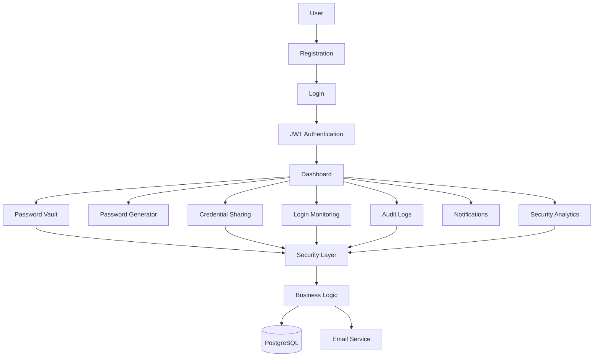
```mermaid
flowchart TD

    USER[User]

    REGISTER[Registration]
    LOGIN[Login]
    AUTH[JWT Authentication]

    DASHBOARD[Dashboard]

    VAULT[Password Vault]
    GENERATOR[Password Generator]
    SHARING[Credential Sharing]
    MONITOR[Login Monitoring]
    AUDIT[Audit Logs]
    NOTIFICATIONS[Notifications]
    ANALYTICS[Security Analytics]

    SECURITY[Security Layer]
    SERVICE[Business Logic]
    DATABASE[(PostgreSQL)]

    EMAIL[Email Service]

    USER --> REGISTER
    REGISTER --> LOGIN
    LOGIN --> AUTH
    AUTH --> DASHBOARD

    DASHBOARD --> VAULT
    DASHBOARD --> GENERATOR
    DASHBOARD --> SHARING
    DASHBOARD --> MONITOR
    DASHBOARD --> AUDIT
    DASHBOARD --> NOTIFICATIONS
    DASHBOARD --> ANALYTICS

    VAULT --> SECURITY
    SHARING --> SECURITY
    MONITOR --> SECURITY
    AUDIT --> SECURITY
    ANALYTICS --> SECURITY

    SECURITY --> SERVICE
    SERVICE --> DATABASE
    SERVICE --> EMAIL
```

---

# 🧱 Complete Project Architecture

```text
                         SECUREVAULT
                              │
              ┌───────────────┴───────────────┐
              │                               │
         FRONTEND                         BACKEND
              │                               │
            React                         Spring Boot
              │                               │
            Vite                        Spring Security
              │                               │
           Axios                              JWT
              │                               │
              └───────────────┬───────────────┘
                              │
                              ▼
                       SERVICE LAYER
                              │
              ┌───────────────┼───────────────┐
              │               │               │
              ▼               ▼               ▼
         Encryption     Notifications     Monitoring
              │               │               │
              └───────────────┼───────────────┘
                              │
                              ▼
                     JPA / Hibernate
                              │
                              ▼
                         PostgreSQL
                              │
                              ▼
                           Docker
                              │
                              ▼
                           AWS EC2
                              │
                              ▼
                           Internet
```

---

# 📊 Security Event Architecture

```text
                    USER ACTION
                         │
                         ▼
                 Spring Security
                         │
                         ▼
                    Controller
                         │
                         ▼
                      Service
                         │
             ┌───────────┼───────────┐
             │           │           │
             ▼           ▼           ▼
         Audit Log   Notification  Login Activity
             │           │           │
             └───────────┼───────────┘
                         │
                         ▼
                    PostgreSQL
                         │
                         ▼
                   Security Analytics
```

---

# 📈 Security Analytics Flow

```mermaid
flowchart TD

    A[User Activities]
    B[Login Activities]
    C[Audit Logs]
    D[Security Events]

    DATABASE[(PostgreSQL)]

    SERVICE[Security Analytics Service]

    TOTAL[Total Logins]
    SUCCESS[Successful Logins]
    FAILED[Failed Logins]
    RECENT[Recent Activity]

    DASHBOARD[Security Analytics Dashboard]

    A --> B
    A --> C
    A --> D

    B --> DATABASE
    C --> DATABASE
    D --> DATABASE

    DATABASE --> SERVICE

    SERVICE --> TOTAL
    SERVICE --> SUCCESS
    SERVICE --> FAILED
    SERVICE --> RECENT

    TOTAL --> DASHBOARD
    SUCCESS --> DASHBOARD
    FAILED --> DASHBOARD
    RECENT --> DASHBOARD
```

---

# 🔄 Complete User Journey

```text
1. User opens SecureVault
        ↓
2. User registers an account
        ↓
3. User logs in
        ↓
4. Backend validates credentials
        ↓
5. JWT token is generated
        ↓
6. Login activity is recorded
        ↓
7. Security notification is generated
        ↓
8. Security email can be sent
        ↓
9. User enters Dashboard
        ↓
10. User creates credentials
        ↓
11. Sensitive credentials are encrypted
        ↓
12. Encrypted credentials are stored
        ↓
13. User can generate strong passwords
        ↓
14. User can share credentials
        ↓
15. Login activities are monitored
        ↓
16. Audit logs are recorded
        ↓
17. Security analytics are generated
        ↓
18. Password expiration is checked
```

---

# 📂 Final Project Structure

```text
Vault-password-Credential-Management-System/
│
├── backend/
│   │
│   ├── src/
│   │   ├── main/
│   │   │   ├── java/
│   │   │   │   └── com/
│   │   │   │       └── securevault/
│   │   │   │           ├── controller/
│   │   │   │           ├── dto/
│   │   │   │           ├── entity/
│   │   │   │           ├── repository/
│   │   │   │           ├── service/
│   │   │   │           ├── security/
│   │   │   │           └── util/
│   │   │   │
│   │   │   └── resources/
│   │   │       └── application.properties
│   │   │
│   │   └── test/
│   │
│   ├── Dockerfile
│   └── pom.xml
│
├── frontend/
│   │
│   ├── src/
│   │   ├── components/
│   │   ├── pages/
│   │   ├── services/
│   │   ├── App.jsx
│   │   └── main.jsx
│   │
│   ├── public/
│   ├── Dockerfile
│   ├── nginx.conf
│   ├── package.json
│   └── vite.config.js
│
├── docker-compose.yml
├── .gitignore
├── README.md
└── .env
```

---

# 🔄 Complete Development Lifecycle

```mermaid
flowchart TD

    A[Project Idea]
    B[Requirement Analysis]
    C[System Design]

    D[Backend Development]
    E[Frontend Development]

    F[Database Integration]
    G[Security Implementation]

    H[Feature Integration]
    I[Testing]
    J[UI Improvements]

    K[Git and GitHub]
    L[Dockerization]
    M[AWS EC2 Setup]
    N[Deployment]
    O[Production Testing]

    P[SecureVault Application]

    A --> B
    B --> C

    C --> D
    C --> E

    D --> F
    E --> F

    F --> G
    G --> H

    H --> I
    I --> J

    J --> K
    K --> L
    L --> M
    M --> N
    N --> O
    O --> P
```

---

# 🌍 Production Application Flow

```text
                         INTERNET
                             │
                             ▼
                       AWS EC2 SERVER
                             │
                        Docker Engine
                             │
             ┌───────────────┼───────────────┐
             │               │               │
             ▼               ▼               ▼
        FRONTEND         BACKEND          DATABASE
        React/Nginx     Spring Boot      PostgreSQL
             │               │               │
             └───────────────┘               │
                     │                       │
                     └───────────────────────┘
```

---

# 📊 Overall Architecture Summary

```text
┌─────────────────────────────────────────────┐
│                   USER                      │
└──────────────────────┬──────────────────────┘
                       │
                       ▼
┌─────────────────────────────────────────────┐
│              REACT FRONTEND                 │
│                  + VITE                     │
└──────────────────────┬──────────────────────┘
                       │
                     Axios
                       │
                       ▼
┌─────────────────────────────────────────────┐
│            SPRING BOOT REST API             │
└──────────────────────┬──────────────────────┘
                       │
              ┌────────┴────────┐
              │                 │
              ▼                 ▼
       SPRING SECURITY         JWT
              │
              ▼
┌─────────────────────────────────────────────┐
│               CONTROLLERS                   │
└──────────────────────┬──────────────────────┘
                       │
                       ▼
┌─────────────────────────────────────────────┐
│                 SERVICES                    │
│                                             │
│ Authentication                              │
│ Credentials                                 │
│ Sharing                                     │
│ Notifications                               │
│ Monitoring                                  │
│ Email                                       │
│ Password Expiration                         │
└──────────────────────┬──────────────────────┘
                       │
                       ▼
┌─────────────────────────────────────────────┐
│              JPA / HIBERNATE               │
└──────────────────────┬──────────────────────┘
                       │
                       ▼
┌─────────────────────────────────────────────┐
│               POSTGRESQL                   │
└──────────────────────┬──────────────────────┘
                       │
                       ▼
┌─────────────────────────────────────────────┐
│             DOCKER / COMPOSE               │
└──────────────────────┬──────────────────────┘
                       │
                       ▼
┌─────────────────────────────────────────────┐
│                 AWS EC2                    │
└─────────────────────────────────────────────┘
```

---

# 🎓 Academic Project Modules

## Module 1 – Authentication

```text
Registration
     ↓
Login
     ↓
BCrypt
     ↓
JWT
     ↓
Authorization
```

## Module 2 – Credential Management

```text
Create
  ↓
Encrypt
  ↓
Store
  ↓
Read
  ↓
Decrypt
  ↓
Update / Delete
```

## Module 3 – Password Security

```text
Password Generator
       ↓
Password Strength
       ↓
Password Encryption
       ↓
Password Expiration
```

## Module 4 – Secure Sharing

```text
Credential Owner
       ↓
Select Credential
       ↓
Select Recipient
       ↓
Create Shared Credential
       ↓
Recipient Access
```

## Module 5 – Security Monitoring

```text
Login Activity
      ↓
Audit Logs
      ↓
Security Analytics
      ↓
Security Awareness
```

## Module 6 – Notification System

```text
Security Event
      ↓
In-App Notification
      ↓
Email Notification
```

## Module 7 – Cloud Deployment

```text
GitHub
   ↓
Docker
   ↓
Docker Compose
   ↓
AWS EC2
   ↓
Production
```

---

# 🚀 Future Enhancements

Possible future improvements include:

* Two-factor authentication
* Biometric authentication
* HTTPS/SSL
* Custom domain
* AWS RDS
* AWS Secrets Manager
* Password breach detection
* Have I Been Pwned integration
* Advanced security analytics
* Role-based access control
* Administrator dashboard
* Password history
* Secure import/export
* Automatic password rotation
* Cloud backup
* Multi-device synchronization
* Session management
* Account recovery
* Advanced security alerts

---

# 🏆 Final Result

SecureVault demonstrates a complete full-stack software development lifecycle.

The final system combines:

* React frontend
* Vite
* Axios
* Spring Boot
* Spring Security
* JWT authentication
* BCrypt password hashing
* AES encryption
* PostgreSQL
* JPA/Hibernate
* Password generation
* Password strength analysis
* Secure credential sharing
* Login monitoring
* Audit logging
* Security analytics
* In-app notifications
* Email notifications
* Password expiration monitoring
* Responsive UI
* Docker
* Docker Compose
* Git
* GitHub
* AWS EC2
* Nginx

The project covers the complete journey from **requirement analysis → architecture → development → security → testing → GitHub → Dockerization → AWS deployment → production testing**.

---

# 📜 License

This project was developed as an academic B.Tech project for educational and demonstration purposes.
